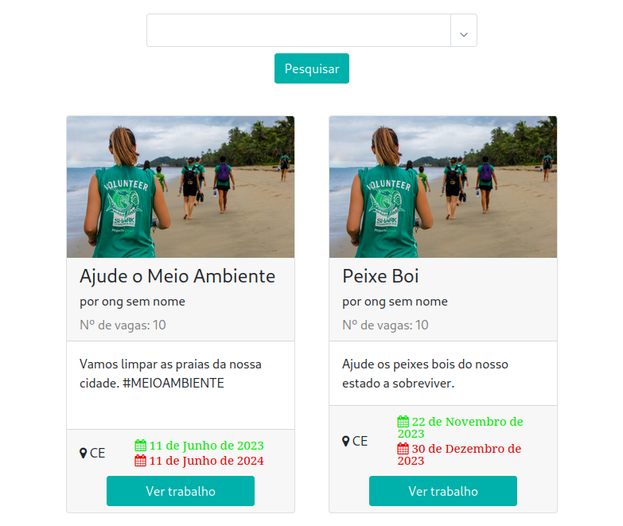
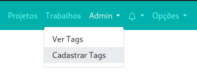

# Extendidos



## How to use

1. prepare the environment and run the server
2. you need an admin account to be able to create tags. To create an admin account run the follow code:
```bash
    python manage.py createsuperuser
```
3. after create an admin account you can create a tag.



4. now NGOs can create projects and within a project it can create some jobs.

5. and last but not least, students can apply to volunteer jobs that were previously created by an NGO.


## Preparing Environment

* Installing Virtual Environment
```bash
    python -m venv .venv
```

* Enter In The Virtual Environment
```bash
    source .venv/bin/activate
```

* Upgrade pip in Virtual Environment
```bash
    pip install --upgrade pip 
```

* Install Dependencies in Virtual Environment
```bash
    pip install -r requirements.txt
```

## Run Server

* Make Migration
```bash
    python manage.py makemigrations 
```

* Migrate
```bash
    python manage.py migrate 
```

* Running Server
```bash
    python manage.py runserver 
```

